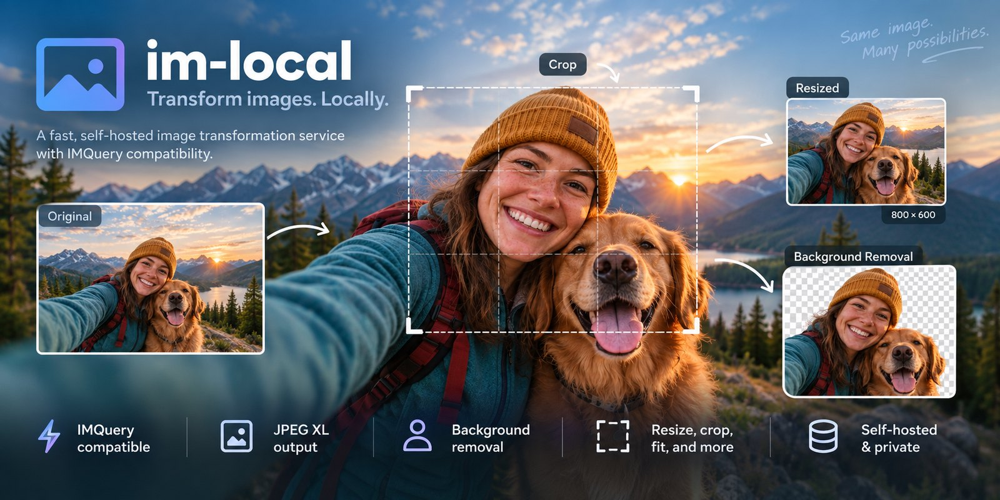

# im-local



Self-hosted image transformation service. Transformations are expressed as a
query-string chain, output formats are negotiated (including JPEG XL), and
background removal runs locally.

**[Open the live demo at im.januschka.com](https://im.januschka.com/)**

## Running

```bash
go build -o image-processor .
IM_ALLOWED_HOSTS=localhost \
IM_ALLOW_PRIVATE_NETWORKS=true \
IM_UPLOADS_ENABLED=true \
DEMO_MODE=1 \
./image-processor   # listens on :8080
```

Endpoints:

- `GET /process` - transform an image
- `GET /doc` - documentation page with a live example per feature
- `GET /sample.jpg`, `GET /sample-studio.jpg` - built-in example images
- `GET /health` - liveness probe

Open <http://localhost:8080/doc> to browse every transformation rendered live by
the running server. The page has a playground with parameter sliders, an upload
area so you can try the transformations on your own image, and per-example size,
timing, and cache information.

## Request parameters

| Parameter | Description |
| --- | --- |
| `url` | Required. Absolute `http`/`https` URL of the pristine image. |
| `im` | Transformation chain, for example `Resize=(250,125);Grayscale`. |
| `imop` | Alias for `im`, kept for backwards compatibility. |
| `width`, `height` | Legacy shortcut equivalent to `im=Resize,width=..,height=..`. |
| `out` | `jpeg`, `png`, `webp`, `avif`, `jxl` are always honoured. `auto` negotiates. Omitted keeps the source format. |
| `prefer` | Preference order for negotiation, for example `avif,webp,jxl`. |
| `quality` | Encoder quality, 1-100. Defaults to 90. |
| `nocache` | Any value recomputes the derivative instead of reading the cache. |

Transformations are applied in the order they appear, separated by `;`. Because
Go's standard query parser rejects `;`, the service reads
`im`/`imop`/`url`/`out`/`quality` directly from the raw query string.

### Output formats

JPEG, PNG, WebP, AVIF, and JPEG XL can be written; JPEG, PNG, GIF, WebP, and
JPEG XL can be read. An explicitly requested format is always produced.

`out=auto` negotiates instead: the first format of the preference list that the
client advertises in `Accept` wins. The default order is `avif,webp,jxl`, and
`prefer` overrides it:

```bash
curl -H 'Accept: image/avif,image/webp,*/*' \
  'http://localhost:8080/process?url=https://example.com/a.jpg&im=Resize=(400,300)&out=auto'
# -> image/avif

curl -H 'Accept: image/avif,image/webp,*/*' \
  '.../process?url=...&out=auto&prefer=webp,avif'
# -> image/webp
```

Only an exact media range with a non-zero `q` counts as support. Wildcards such
as `image/*` do not, because browsers send them for formats they cannot decode.
Responses carry `Vary: Accept`, and the cache key includes the negotiated
format, so a client never receives a format it did not ask for.

Transformations such as Rotate, Shear, and Background Remove add an alpha
channel. A negotiated format switches to PNG in that case rather than flattening
the image onto white; ask for `out=jpeg` explicitly if you want that.

`quality` (1-100, default 90) is mapped per encoder: JPEG, WebP, and JPEG XL use
it directly, AVIF uses 75% of it, because the same number means a much larger
file there.

Encoding uses the [gen2brain](https://github.com/gen2brain) codec bindings,
which call a shared `libavif`, `libwebp`, or `libjxl` when one can be loaded and
otherwise run the same library compiled to WASM. No CGo is involved either way.

The shared libraries are considerably faster. They are looked up by plain name,
which macOS does not search for in `/usr/local/lib`, so symlink them next to the
binary:

```bash
brew install jpeg-xl libavif webp
ln -sf /usr/local/lib/libjxl.dylib libjxl.dylib
ln -sf /usr/local/lib/libavif.dylib libavif.dylib
ln -sf /usr/local/lib/libwebp.dylib libwebp.dylib
ln -sf /usr/local/lib/libwebpdemux.dylib libwebpdemux.dylib
```

On Linux, install `libjxl-dev`, `libavif-dev`, and `libwebp-dev`, which is what
the container image does. The startup log reports which backend each encoder
uses.

## Supported transformations

| Transformation | Example |
| --- | --- |
| Append | `im=Append,image=(url=https://example.com/b.jpg),gravity=East` |
| Background Remove | `im=BackgroundRemove` (see below) |
| Aspect Crop | `im=AspectCrop=(16,9),xPosition=.5,yPosition=.3[,allowExpansion]` |
| Background Color | `im=BackgroundColor,color=00ff00` |
| Blur | `im=Blur=2` |
| Chroma Key | `im=ChromaKey,hue=120,hueTolerance=0.083,saturationTolerance=0.75` |
| Composite | `im=Composite,image=(url=...),gravity=SouthEast,scale=0.2,opacity=0.5,placement=over` |
| Contrast | `im=Contrast,contrast=0.5` |
| Crop | `im=Crop,rect=(0,0,100,100),gravity=Center[,allowExpansion]` |
| Face Crop | `im=FaceCrop,width=300,height=300` |
| Feature Crop | `im=FeatureCrop,size=(500,200)` |
| Fit and Fill | `im=FitAndFill=(400,500)` |
| Goop | `im=Goop,chaos=1` |
| Grayscale | `im=Grayscale` |
| HSL | `im=HSL,hue=0.1,saturation=1.5,lightness=1.1` |
| HSV | `im=HSV,hue=0.5,saturation=2,value=1` |
| If Dimension | `im=IfDimension,value=1000,dimension=width,greaterThan=$(Blur=5),default=$(Grayscale)` |
| If Orientation | `im=IfOrientation,landscape=$(Resize=(800,450)),portrait=$(Resize=(450,800))` |
| Max Colors | `im=MaxColors,colors=35` |
| Mirror | `im=Mirror,horizontal` or `im=Mirror,vertical` |
| Mono Hue | `im=MonoHue,hue=210` |
| Opacity | `im=Opacity=0.5` |
| Region of Interest Crop | `im=RegionOfInterestCrop=(400,300),regionOfInterest=(150,200)` |
| Relative Crop | `im=RelativeCrop,north=10,south=10` |
| Remove Color | `im=RemoveColor,color=ffffff,tolerance=0.2,feather=0.1` |
| Resize | `im=Resize=(250,125)` or `im=Resize,width=250` |
| Rotate | `im=Rotate,degrees=13` |
| Scale | `im=Scale,width=0.5,height=0.5` |
| Shear | `im=Shear,x=0.2,y=0` |
| Smart Crop | `im=SmartCrop,size=(500,200)` |
| Trim | `im=Trim,tolerance=0.02` |
| Unsharp Mask | `im=UnsharpMask,gain=2.0` |

Notes on behaviour:

- Both shorthands work: `Resize=(w,h)`, `Resize,size=(w,h)`, and
  `Resize,width=..,height=..`. Omitting one dimension preserves aspect ratio.
- Flags without values are supported, for example `allowExpansion` and
  `horizontal`.
- Face Crop and Smart Crop use the bundled pigo cascade; Smart Crop falls back
  to Feature Crop when no face is detected.
- Unknown transformations return HTTP 400 instead of silently passing through.
- Transparency-producing transformations (Rotate, Shear, Relative Crop, Chroma
  Key, Remove Color, Opacity) are flattened onto white for JPEG output. Use
  `out=png`, `out=jxl`, or a following `BackgroundColor` to control that.

## Background removal

`im=BackgroundRemove` cuts the subject out of a photo the way hosted services
such as remove.bg do, but entirely locally: it runs a salient-object
segmentation model with onnxruntime, and there is no account, API key, or
subscription involved.

```bash
curl -o cut.png \
  'http://localhost:8080/process?url=https://example.com/photo.jpg&im=BackgroundRemove&out=png'
```

| Argument | Default | Description |
| --- | --- | --- |
| `model` | `isnet-general-use` | Also `u2net`, `silueta`, `u2netp`. |
| `threshold` | `0` | Above 0 the soft mask is hardened around this coverage. |
| `feather` | `0.1` | Width of the ramp around `threshold`. |
| `refine` | `1` | Guided-filter edge refinement. `0` uses the raw model mask. |
| `decontaminate` | `1` | Removes the background colour bleeding into semi-transparent edge pixels. `0` keeps the original pixels. |
| `method` | `model` | `color` uses the offline colour method described below. |
| `fallback` | none | `color` falls back to the colour method when the model is unavailable. |

The image is letterboxed rather than squashed before inference, the mask is
refined against the image edges with a guided filter, and partially transparent
pixels are colour-decontaminated so the cut-out carries no halo of the old
background.

Use `out=png` or `out=jxl` to keep the alpha channel; JPEG has none and is
flattened onto white. Chain transformations to replace the background:

```
im=BackgroundRemove;BackgroundColor,color=0b7285
im=BackgroundRemove;Composite,image=(url=https://example.com/studio.jpg),placement=under
```

### Setup

Two things are resolved at runtime, so the service also starts without them:

1. **onnxruntime shared library.** Searched in the usual install locations, or
   set `ONNXRUNTIME_SHARED_LIBRARY=/path/to/libonnxruntime.so`. The container
   image ships one. Locally, grab a release from
   [microsoft/onnxruntime](https://github.com/microsoft/onnxruntime/releases):

   ```bash
   curl -L -o ort.tgz https://github.com/microsoft/onnxruntime/releases/download/v1.23.0/onnxruntime-osx-x86_64-1.23.0.tgz
   tar xzf ort.tgz
   export ONNXRUNTIME_SHARED_LIBRARY=$PWD/onnxruntime-osx-x86_64-1.23.0/lib/libonnxruntime.dylib
   ```

2. **Model weights.** Downloaded on first use into `./models` from the rembg
   model zoo (`isnet-general-use` is 176 MB). Set
   `IM_SEGMENTATION_DOWNLOAD=0` to disable downloads, or point
   `IM_SEGMENTATION_MODEL_<NAME>` at an existing file, for example
   `IM_SEGMENTATION_MODEL_ISNETGENERALUSE=/models/isnet.onnx`.

Expect roughly two seconds per uncached image with `isnet-general-use` on a
laptop CPU; `u2netp` is about ten times smaller and faster at lower quality.
Results are cached like any other derivative.

### Colour method

`im=BackgroundRemove,method=color` needs no model at all. It learns a colour
model from the image border, erases only background-coloured regions that are
connected to the border, and feathers the edge. It suits clean studio backdrops
and product shots, not busy scenes. Arguments: `tolerance` (0.12), `feather`
(0.08), `colors` (4), `margin` (2).

## Configuration

Network fetching and uploads both fail closed: neither is enabled by default.
Everything is configured through the environment.

| Variable | Default | Purpose |
| --- | --- | --- |
| `IM_PORT` | `8080` | Listen port. |
| `IM_ALLOWED_HOSTS` | empty | Comma-separated source hosts. `*` permits public hosts only; `*.example.com` includes the base domain. |
| `IM_ALLOWED_PATH_PREFIXES` | empty | Optional source-path allowlist. A trailing `/` permits descendants. |
| `IM_ALLOW_PRIVATE_NETWORKS` | `false` | Permit loopback/private/link-local source addresses and non-standard ports. Use only for local development. |
| `IM_INSECURE_TLS` | `false` | Skip source TLS verification. Never use on a public deployment. |
| `IM_MAX_IMAGE_BYTES` | `16777216` | Maximum compressed source bytes. |
| `IM_MAX_IMAGE_PIXELS` | `20000000` | Maximum decoded source pixels. |
| `IM_MAX_OUTPUT_PIXELS` | `25000000` | Maximum derivative pixels. |
| `IM_MAX_DIMENSION` | `8192` | Maximum width or height. |
| `IM_MAX_TRANSFORMATIONS` | `20` | Maximum operations, including nested conditionals. |
| `IM_MAX_QUERY_BYTES` | `16384` | Maximum raw query-string size. |
| `IM_MAX_CONCURRENT` | `4` | Simultaneous processing requests per instance. |
| `IM_QUEUE_TIMEOUT` | `5s` | How long excess work waits before HTTP 503. |
| `IM_UPLOADS_ENABLED` | `false` | Enable `POST /upload`. |
| `IM_UPLOAD_TOKEN` | empty | Optional bearer token required by `/upload`. |
| `IM_MAX_UPLOAD_BYTES` | `10485760` | Maximum compressed upload bytes. |
| `IM_UPLOAD_STORAGE_BYTES` | `536870912` | Upload-directory quota; oldest files are removed first. |
| `IM_UPLOAD_TTL` | `1h` | Uploaded-file lifetime. |
| `IM_CACHE_STORAGE_BYTES` | `5368709120` | Cache-directory quota. |
| `IM_CACHE_DIR` | `./cache` | Derivative cache. |
| `IM_MODEL_DIR` | `./models` | Segmentation weights. |
| `IM_UPLOAD_DIR` | `./uploads` | Uploaded pristine images. |
| `IM_CACHE_TTL` | `24h` | Cache lifetime. |
| `DEMO_MODE` | `false` | Every 90 minutes, delete cache/upload artifacts older than 90 minutes. Models remain. |
| `ONNXRUNTIME_SHARED_LIBRARY` | searched | Path to the onnxruntime library. |
| `IM_SEGMENTATION_DOWNLOAD` | `1` | `0` disables model downloads. |

The HTTP client validates every redirect, resolves DNS itself, pins the
connection to the checked address, and rejects loopback, private, link-local,
multicast, and unspecified addresses unless private networking is explicitly
enabled. Source credentials, unsafe path traversal, and non-standard public
ports are rejected.

If a deployment allows its own hostname, configure
`IM_ALLOWED_PATH_PREFIXES`; otherwise an attacker could recursively use
`/process` as its own source. The included public-demo manifest allows only the
sample and upload paths.

## Deployment

```bash
docker build -t im-local .
docker run -p 8080:8080 \
  -e IM_ALLOWED_HOSTS='images.example.com' \
  -e IM_ALLOWED_PATH_PREFIXES='/public-images/' \
  im-local
```

The image ships onnxruntime and shared codec libraries.
`deploy/kubernetes.yaml` is configured for `im.januschka.com` and includes TLS,
ingress request/connection limits, CPU/memory/storage bounds, a maximum of three
replicas, and an egress NetworkPolicy that blocks private networks. It enables
anonymous demo uploads, bounds them to 512 MiB, and sets `DEMO_MODE=1`.

```bash
kubectl apply -f deploy/kubernetes.yaml
```

The NetworkPolicy requires a CNI that enforces NetworkPolicy. The Ingress
annotations target ingress-nginx, and TLS issuance assumes cert-manager with a
`letsencrypt-prod` ClusterIssuer. Adapt those pieces to your cluster.

## Security model

The application provides defense in depth, but an expensive public image API
still needs an edge rate limit. The supplied ingress limits each client to two
requests per second, a short burst, and ten connections. Keep the hostname and
path allowlists narrow, never set `IM_ALLOWED_HOSTS=*` together with
`IM_ALLOW_PRIVATE_NETWORKS=true`, and do not expose anonymous uploads without
both ingress limits and storage quotas.

## Caching

Derivatives are cached on disk under `./cache` and written atomically. The key
is built from everything that changes the bytes: source URL, transformation
chain, negotiated output format, and quality. Parameter order therefore does not
matter, and `?im=X&url=Y` reuses the entry of `?url=Y&im=X`. The default TTL is
24 hours; `nocache=1` recomputes an entry and stores the fresh result.

Every response carries `ETag` (conditional requests answer `304`),
`Cache-Control`, `Vary: Accept`, plus these diagnostics used by the
documentation page:

| Header | Meaning |
| --- | --- |
| `X-Cache` | `HIT` when the derivative came from disk, `MISS` when it was rendered. |
| `X-Process-Time-Ms` | Server-side time for the request. |
| `X-Image-Width`, `X-Image-Height` | Dimensions of the derivative. |

Uploaded pristine images are stored in the upload directory under a content
hash and served from `/uploads/<name>`.

## Tests

```bash
go test ./...
```
